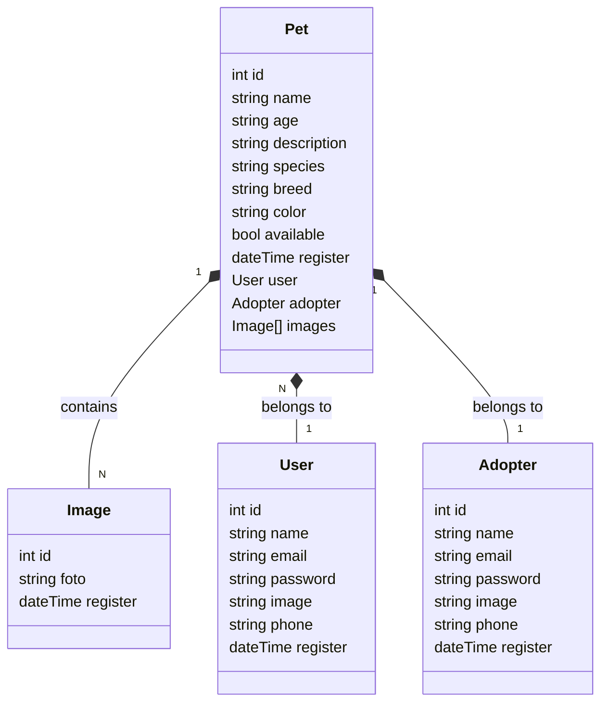

## Spring Boot e Angular (17+) 2024
Jave RESTful API para o Deal

## Diagrama de Classes

```mermaid
classDiagram
    class Pet {
        int id
        string name
        string age
        string description
        string species
        string breed
        string color
        bool available
        dateTime register
        User user
        Adopter adopter
        Image[] images
    }

    class Image {
        int id
        string foto
        dateTime register
    }

    class User {
        int id
        string name
        string email
        string password
        string image
        string phone
        dateTime register
    }

    class Adopter {
        int id
        string name
        string email
        string password
        string image
        string phone
        dateTime register
    }

    Pet "1" *-- "N" Image : contains
    Pet "N" *-- "1" User : belongs to
    Pet "1" *-- "1" Adopter : belongs to
```
