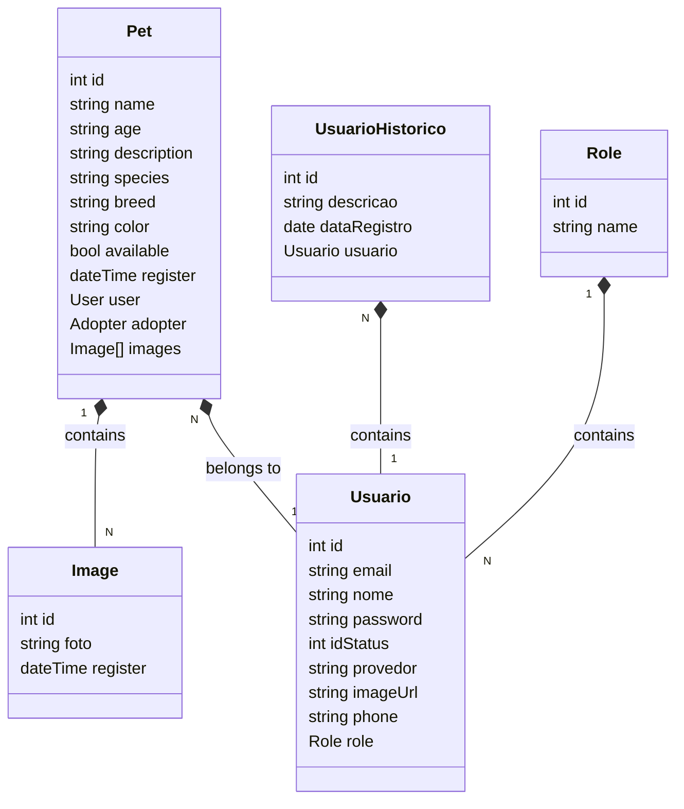

<p align="center">  
  <a href="https://dio.me" target="blank"></a>
</p>

## Description
Spring Boot e Angular (17+) 2024 - Jave RESTful API para o Deal

## Technologies used
* Docker
* Java 17
* Jococo
* JUnit
* JWT for REST API
* Maven
* Model Mapper
* Mokito
* PostgreSQL
* Swagger
* Surfire
* Scheduling Tasks
* Spring Boot
* Spring Statemachine
* Testes Unitários e de Integração
## Diagrama de Classes



### Compile and Package

The API also was developed to run with an `jar`. In order to generate this `jar`, you should run:

```bash
mvn package
```

It will clean, compile and generate a `jar` at target directory, e.g. `Template-API-java-1.0-SNAPSHOT.jar`

### Execution

You need to have **PostgreSQL 9.4.xx or above** installed on your machine to run the API on `dev` profile. After installed, on the `pgAdmin` create a database named `travels`. If you don't have `pgAdmin` installed you can run on the `psql` console the follow command:

```sql
CREATE database db-desenv;
```

After creating the API database, you need to add your **Postgres** root `username` and `password` in the `application.properties` file on `src/main/resource`. The lines that must be modified are as follows:

```properties
spring.datasource.username=
spring.datasource.password=
```

### Test

* For unit test phase, you can run:

```bash
mvn test
```

### Run

In order to run the API, run the jar simply as following:

```bash
java -jar Template-API-java-1.0-SNAPSHOT.jar --spring.profiles.active=dev
```
    
or

```bash
mvn spring-boot:run -Dspring.profiles.active=dev
```

By default, the API will be available at [http://localhost:8080/api](http://localhost:8080/api)

### Documentation

* Swagger (development environment): [http://localhost:8080/swagger-ui/index.html](http://localhost:8080/swagger-ui/index.html)


## Docker

```bash
$ MAVEN_PROFILE=prod docker compose up -d
```
## Stay in touch

- Author - [Cledson Francisco Silva](https://www.linkedin.com/in/cledson-francisco-silva-32737a2a/)
- E-mail - [cledsonfs@gmail.com](mailto:cledsonfs@gmail.com)
